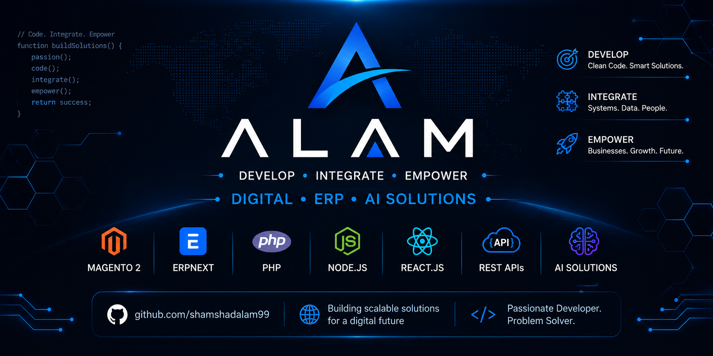

  

  

<h1 align="center">
  Hi, I'm Shamshad Alam 👋
</h1>

<h3 align="center">
  Develop • Integrate • Empower
</h3>

  <strong>Digital • ERP • AI Solutions</strong>

  Building practical software solutions for eCommerce, ERP, automation and AI.

---

## 👨‍💻 About Me

I'm a Full-Stack Developer focused on building practical, scalable and
business-oriented software solutions.

My core experience includes **Magento 2, ERPNext, PHP, APIs, eCommerce,
business automation and modern web technologies**.

I enjoy turning real business requirements into reliable digital systems —
from eCommerce platforms and ERP integrations to custom modules,
automation tools and AI-powered applications.

---

## 🚀 What I Build

- 🛒 Magento 2 Extensions & Customizations
- 🔗 ERPNext Integrations & Custom Development
- 🔌 REST API & Third-Party Integrations
- 💳 Payment Gateway Integrations
- ⚙️ Business Process Automation
- 🤖 AI-Powered Business Solutions
- 🌐 Custom Web Applications
- 📦 eCommerce Solutions

---

## 🧠 Core Expertise

### Backend

- PHP
- Magento 2
- ERPNext / Frappe
- Node.js
- MySQL
- REST APIs

### Frontend

- JavaScript
- React.js
- AJAX
- HTML5
- CSS3

### Tools & Platforms

- Git & GitHub
- Linux
- Magento
- ERPNext
- WordPress
- Cloud Hosting

---

## 🔧 What I'm Working On

### ALAM — Digital • ERP • AI Solutions

I'm building **ALAM** as my personal technology brand focused on creating
useful software, developer tools, integrations and digital solutions.

Current areas of development:

- 🚀 Magento 2 Extensions
- 🔗 ERPNext Integrations
- ⚙️ Business Automation
- 🤖 AI-Powered Applications
- 🧩 Developer Tools
- 🌐 Custom Digital Solutions

---

## 📂 Featured Projects

### 🚀 Coming Soon

Some projects I'm working toward:

- **ALAM Magento 2 Module Boilerplate**
- **ALAM ERP Connector**
- **Magento 2 REST API Examples**
- **ERPNext PHP SDK**
- **AI Product Description Generator**
- **Business Automation Tools**

More projects will be published here as they are ready.

---

## 🌱 My Development Philosophy

> Build useful things.  
> Solve real problems.  
> Integrate systems.  
> Automate repetitive work.  
> Keep learning.

---

## 📫 Connect With Me

🌐 **Website:** Coming Soon

💼 **LinkedIn:**  
https://www.linkedin.com/in/shamshadalam99/

💻 **GitHub:**  
https://github.com/shamshadalam99

---

  <strong>Develop • Integrate • Empower</strong>

  Digital • ERP • AI Solutions

